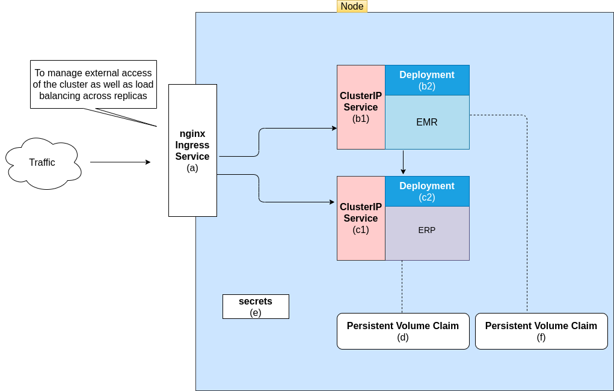
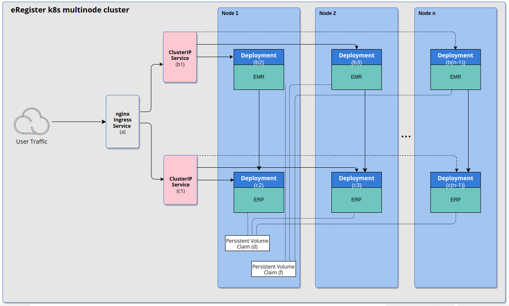

# bahmni_docker

The proposed single node is going look something like:

**Fig 1 - Single Node Cluster**

The  multinode cluster will on the other hand look like this:

**Fig 2 - Multinode Cluster**
